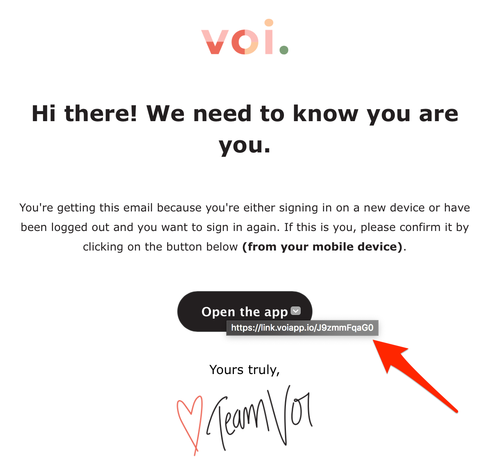

# VOI Bike unofficial go client

This is an unofficial REST API client written in go to communicate with the VOI Bike API. In order to reverse engineer the API I used mitmproxy.

## Authentication

First send out a login email by using the app or running the following snippet:
```go
package main

import (
    voi "dennis-tra/voi-client-go/pkg"
)

func main() {
    client := voi.NewClient()

    err := client.SendLoginMail("my@mail.com")
    if err != nil {
        panic(err)
    }
}

```

As soon as you receive the mail just copy the link behind the "Open the app" button and call the `Authenticate` method with that link:


```go
package main

import (
    voi "dennis-tra/voi-client-go/pkg"
)

func main() {
    client := voi.NewClient()
    
    // Alternatively just pass in the token `J9zmmFqaG0`
    err := client.Authenticate("https://link.voiapp.io/J9zmmFqaG0")
    if err != nil {
        panic(err)
    }
}
```

Now the `client` has stored the relevent tokens internally for all subsequent requests. As of Oct 2019 the access token is valid for 15 min and the refresh token for 90 days. 

**Right now no token refresh is implemented**
